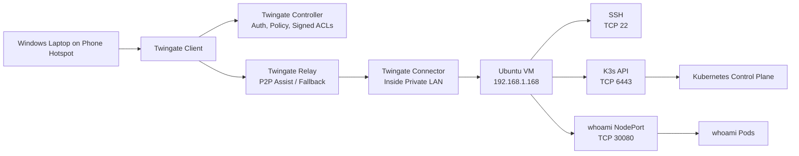

# Private Kubernetes Management Plane with Twingate and K3s

This project demonstrates secure remote administration of a private K3s environment using Twingate.

The lab allows an authorized Windows client to:

- SSH into a private Ubuntu VM over TCP 22
- Manage a private K3s API over TCP 6443 using kubectl
- Access an internal Kubernetes demo app over TCP 30080

No public inbound port forwarding is used for SSH, the Kubernetes API, or the demo application.

## Practical Use Case

The practical use case is secure remote administration of a private Kubernetes environment.

Instead of exposing the K3s API server to the public internet, the API endpoint remains private at:

```text
192.168.1.168:6443
```

A remote administrator connects from a Windows laptop using the Twingate Client. The local `kubectl` configuration points to the private API endpoint. Twingate intercepts traffic to the protected Resource and proxies it through the Connector inside the private network.

## Architecture



Note: The Controller is part of the control plane for authentication, configuration, and authorization. It is not the application data path.

## Components

- Proxmox virtualization host
- Ubuntu VM
- K3s lightweight Kubernetes
- Twingate Connector
- Twingate Client on Windows
- Protected Resource for SSH on TCP 22
- Protected Resource for Kubernetes API access on TCP 6443
- Protected Resource for demo app access on TCP 30080
- Kubernetes Deployment and NodePort Service

## Access Segmentation

Separate Twingate Resources are used for separate operational purposes:

| Resource | Address | Port | Purpose |
|---|---:|---:|---|
| k3s-ssh | 192.168.1.168 | TCP 22 | Linux administration |
| k3s-api | 192.168.1.168 | TCP 6443 | Kubernetes administration with kubectl |
| whoami-demo | 192.168.1.168 | TCP 30080 | Private application access |

This avoids granting broad access to the entire LAN or all ports on the VM.

## Validation From External Network

These tests are run from a Windows PC on a phone hotspot with Twingate connected:

```powershell
Test-NetConnection 192.168.1.168 -Port 22
ssh k3-demo@192.168.1.168

Test-NetConnection 192.168.1.168 -Port 6443
kubectl get nodes -o wide

Test-NetConnection 192.168.1.168 -Port 30080
curl.exe http://192.168.1.168:30080
```

## Local VM Validation

```bash
./scripts/healthcheck.sh
kubectl get nodes -o wide
kubectl get pods -n demo -o wide
kubectl get svc -n demo -o wide
curl http://192.168.1.168:30080
```

## Why This Matters

This setup allows remote access to private infrastructure without exposing SSH, the Kubernetes API, or internal application ports directly to the public internet.

Access is controlled through:

- Twingate identity and policy
- Protected Resources
- Port restrictions
- Connector placement inside the private network
- SSH key authentication
- Kubernetes API credentials

## Key Troubleshooting Lessons

- `Connection refused`: host reachable, but service is not listening on that port.
- `Connection timed out`: routing, firewall, policy, Resource assignment, or Connector path issue.
- `Permission denied`: network path worked, but authentication failed.
- K3s uses Kubernetes concepts like Pods, Deployments, and Services.
- K3s uses containerd by default, not Docker directly.
- Kubernetes pod networking is separate from the normal LAN interface.

## Scripts

| Script | Purpose |
|---|---|
| `scripts/healthcheck.sh` | Runs local health checks on the VM |
| `scripts/validate-k3s-twingate.ps1` | Runs remote validation from Windows |

## Documentation

| File | Purpose |
|---|---|
| `docs/twingate-architecture.md` | Explains Client, Connector, Controller, Relay, and NAT traversal |
| `docs/troubleshooting.md` | Troubleshooting runbook |
| `docs/support-ticket-simulation.md` | Example support ticket write-up |
| `docs/packet-capture-notes.md` | Packet capture notes using tcpdump |
| `docs/job-alignment.md` | Maps project to role requirements |
| `docs/cloud-mapping.md` | Explains how the pattern maps to cloud infrastructure |
| `docs/interview-brief.md` | Short interview explanation |
