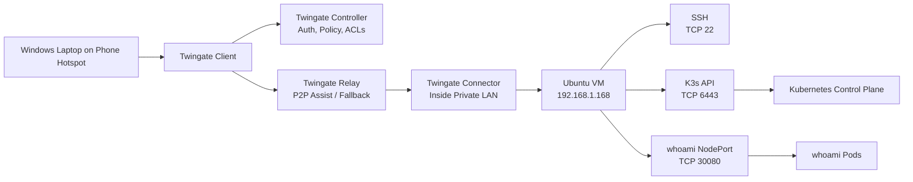

# Private Kubernetes Management Plane with Twingate and K3s

A hands-on lab for securely accessing private infrastructure with Twingate, Ubuntu, and K3s.

This project shows how an authorized Windows client can remotely access private services without opening inbound ports to the public internet.

## What This Lab Does

The lab allows an authorized remote client to:

- SSH into a private Ubuntu VM over TCP 22
- Manage a private K3s API over TCP 6443 using `kubectl`
- Access an internal Kubernetes demo app over TCP 30080
- Validate access from an external network using a phone hotspot

No public inbound port forwarding is used for SSH, the Kubernetes API, or the demo application.

## Why I Built This

I built this because I wanted to understand Twingate in a real way, not just read the docs and repeat buzzwords.

The first goal was simple: can I SSH into a private Ubuntu VM from outside my home network without opening ports on my router?

Once that worked, I pushed it further:

- Can I reach the private K3s API from Windows PowerShell?
- Can I run `kubectl` from outside my LAN?
- Can I access an internal Kubernetes app through Twingate?
- Can I explain what breaks when the error is refused, timed out, or permission denied?

That turned this from a basic SSH test into a small private management plane for a K3s lab.

## Practical Scenario

The practical scenario is straightforward:

A remote engineer needs to manage a private Kubernetes environment, but SSH and the Kubernetes API should not be exposed to the public internet.

In this lab, the private VM lives at:

```text
192.168.1.168
```

The K3s API is available privately at:

```text
192.168.1.168:6443
```

From a normal external network, that private IP should not be reachable. With Twingate connected and the right Resource access, Windows PowerShell can reach the VM, run `kubectl`, and hit the internal demo app.

That is the main point of the project: private access works, but public exposure is avoided.

## Architecture



Note: This diagram is simplified. The Controller handles authentication, configuration, and authorization decisions. Application traffic flows through the Client, Connector, and private Resource path.

## Components

- Proxmox virtualization host
- Ubuntu VM
- K3s lightweight Kubernetes
- Twingate Connector
- Twingate Client on Windows
- Kubernetes Deployment and NodePort Service
- Bash and PowerShell validation scripts

## Access Segmentation

Separate Twingate Resources are used for separate operational purposes:

| Resource | Address | Port | Purpose |
|---|---:|---:|---|
| `k3s-ssh` | `192.168.1.168` | TCP 22 | Linux host administration |
| `k3s-api` | `192.168.1.168` | TCP 6443 | Kubernetes administration with `kubectl` |
| `whoami-demo` | `192.168.1.168` | TCP 30080 | Private demo application access |

Each Resource is restricted to the required TCP port instead of granting broad access to the entire VM or LAN.

## Validation From an External Network

To make sure this was not just normal LAN access, I tested from a Windows PC on a phone hotspot.

With Twingate connected, these worked:

```powershell
Test-NetConnection 192.168.1.168 -Port 22
Test-NetConnection 192.168.1.168 -Port 6443
Test-NetConnection 192.168.1.168 -Port 30080

ssh k3-demo@192.168.1.168
kubectl get nodes -o wide
kubectl get pods -n demo -o wide
curl.exe http://192.168.1.168:30080
```

The important part is that PowerShell shows the traffic using the Twingate interface, and `kubectl` works against the private K3s API from outside the LAN.

## Local VM Validation

```bash
./scripts/healthcheck.sh
kubectl get nodes -o wide
kubectl get pods -n demo -o wide
kubectl get svc -n demo -o wide
curl http://192.168.1.168:30080
```

## Screenshots

| Screenshot | What it Shows |
|---|---|
| `screenshots/twingate-connector-online.png` | Twingate Connector online inside the private network |
| `screenshots/twingate-resources.png` | Separate protected Resources for SSH, K3s API, and demo app |
| `screenshots/powershell-port-tests.png` | TCP validation from Windows over Twingate |
| `screenshots/kubectl-from-windows.png` | Remote `kubectl` access to the private K3s API |
| `screenshots/whoami-curl.png` | Internal demo app reachable through Twingate |
| `screenshots/healthcheck-output.png` | Local VM health check output |

## Kubernetes Demo App

The demo app uses:

- A `demo` namespace
- A `whoami` Deployment
- Two pod replicas
- A NodePort Service exposed on TCP 30080

Apply the manifest:

```bash
kubectl apply -f k8s/whoami.yaml
```

Check the workload:

```bash
kubectl get pods -n demo -o wide
kubectl get svc -n demo -o wide
```

## Scripts

| Script | Purpose |
|---|---|
| `scripts/healthcheck.sh` | Runs local health checks on the Ubuntu VM |
| `scripts/validate-k3s-twingate.ps1` | Runs remote validation from Windows |

## Documentation

| File | Purpose |
|---|---|
| `docs/twingate-architecture.md` | Explains Client, Connector, Controller, Relay, and NAT traversal |
| `docs/troubleshooting.md` | Troubleshooting runbook |
| `docs/support-ticket-simulation.md` | Example support-ticket style write-up |
| `docs/packet-capture-notes.md` | Packet capture notes using `tcpdump` |
| `docs/cloud-mapping.md` | Explains how the same access pattern maps to cloud infrastructure |
| `docs/demo.md` | Demo walkthrough |

## Troubleshooting Concepts

| Symptom | Likely Meaning |
|---|---|
| `Connection refused` | Host is reachable, but the service is not listening on that port |
| `Connection timed out` | Routing, firewall, policy, Resource assignment, or Connector path issue |
| `Permission denied` | Network path worked, but authentication failed |

## What I Learned

This lab helped connect a lot of concepts that are easy to memorize but harder to actually understand until you build something:

- `Connection refused` usually means the host is reachable, but the service is not listening.
- `Connection timed out` usually points to routing, firewall, policy, Connector, or Resource access.
- `Permission denied` means the network path worked, but authentication failed.
- K3s uses containerd by default, so Kubernetes does not need Docker as the runtime.
- A private Kubernetes API can still be managed remotely without being public.
- Testing from a phone hotspot is a simple way to prove the access path is not just local LAN routing.
- Separating Resources by port is cleaner than exposing the entire VM or LAN.

## Future Improvements

- Add DNS-based Resources instead of IP-only Resources
- Add Ingress and TLS for cleaner application access
- Add monitoring with Prometheus/Grafana
- Add a second K3s node
- Deploy a cloud version using AWS, Azure, or GCP
- Add CI checks for Kubernetes manifests and scripts
